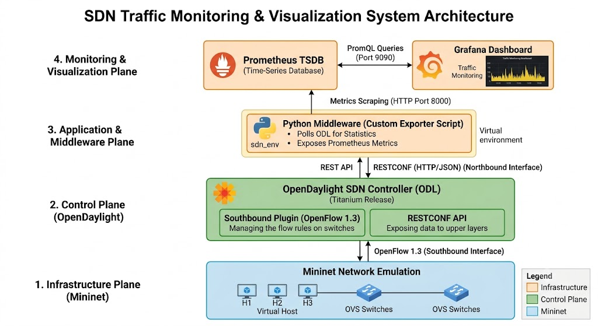
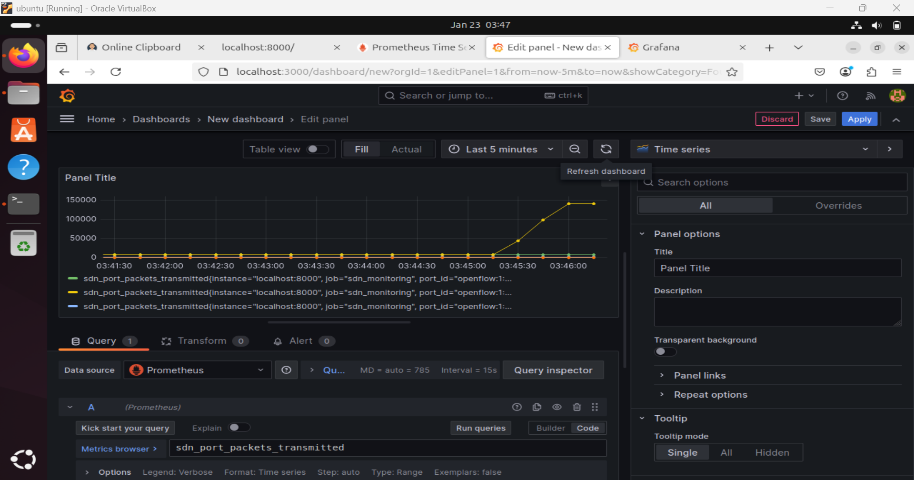

# SDN-Based Network Traffic Monitoring & Visualization System

## 📌 Project Overview
This project implements a centralized network monitoring system using Software-Defined Networking (SDN) principles. By decoupling the control plane from the data plane, this system collects real-time traffic statistics and visualizes them to detect network anomalies, such as sudden bandwidth spikes or DDoS simulations.

## 🏗️ Architecture
* **Infrastructure Layer (Data Plane):** Mininet (Virtual Switches & Hosts)
* **Control Layer (Brain):** OpenDaylight Controller (Titanium Release)
* **Middleware (The Bridge):** Custom Python Exporter (REST API to Prometheus)
* **Storage & Visualization:** Prometheus (TSDB) & Grafana

 *(Add a diagram or photo of your handwritten architecture notes here)*

## 🚀 Technologies Used
* **Ubuntu Linux**
* **Mininet** (Network Emulator)
* **OpenDaylight (ODL)** (SDN Controller)
* **OpenFlow 1.3** (Southbound Protocol)
* **Python 3** (`requests`, `prometheus_client`)
* **Prometheus & Grafana**

---

## ⚙️ Installation & Setup

### 1. Network Simulation (Mininet)
Start the virtual network with 1 switch and 3 hosts, connecting remotely to the ODL controller via OpenFlow 1.3:
```bash
sudo mn --controller=remote,ip=127.0.0.1,port=6633 --topo=single,3 --switch=ovsk,protocols=OpenFlow13
```
### 2. SDN Controller (OpenDaylight)
Ensure Java 21 is installed. Launch the Karaf container and install necessary RESTCONF and OpenFlow features:
```bash
./bin/karaf
feature:install odl-restconf odl-openflowplugin-flow-services-rest
```

### 3. Data Collection Middleware
The Python exporter fetches live flow statistics from OpenDaylight's Northbound REST API.
```bash
cd exporter
python3 -m venv sdn_env
source sdn_env/bin/activate
pip install -r requirements.txt
python3 sdn_exporter.py
```
*The exporter runs on `http://localhost:8000/metrics`*

### 4. Prometheus & Grafana
Start Prometheus using the custom configuration file to scrape the Python exporter:
```bash
./prometheus --config.file=config/prometheus.yml
```

---

## 📊 Results & Anomaly Detection
To verify the system, a high-bandwidth UDP flood was simulated using `iperf` between virtual hosts (`h1 iperf -u -c 10.0.0.2 -b 50M`). 

The custom Grafana dashboard successfully captured the real-time anomaly, as seen in the traffic spike below:

 
*(Note: Replace this image path with your actual Grafana screenshot)*
